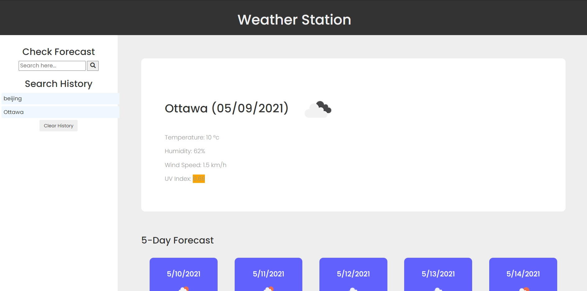

# weather-station
Weather Station is an HTML, CSS, and Javascript based web app that searches for worldwide city forecasts via text input or clickable search history. History is maintained in localStorage and persists between sessions.

## Photo of deployed app

## Link to deployed app
[Click here](https://wingeh.github.io/weather-station/) to view the deployed app.